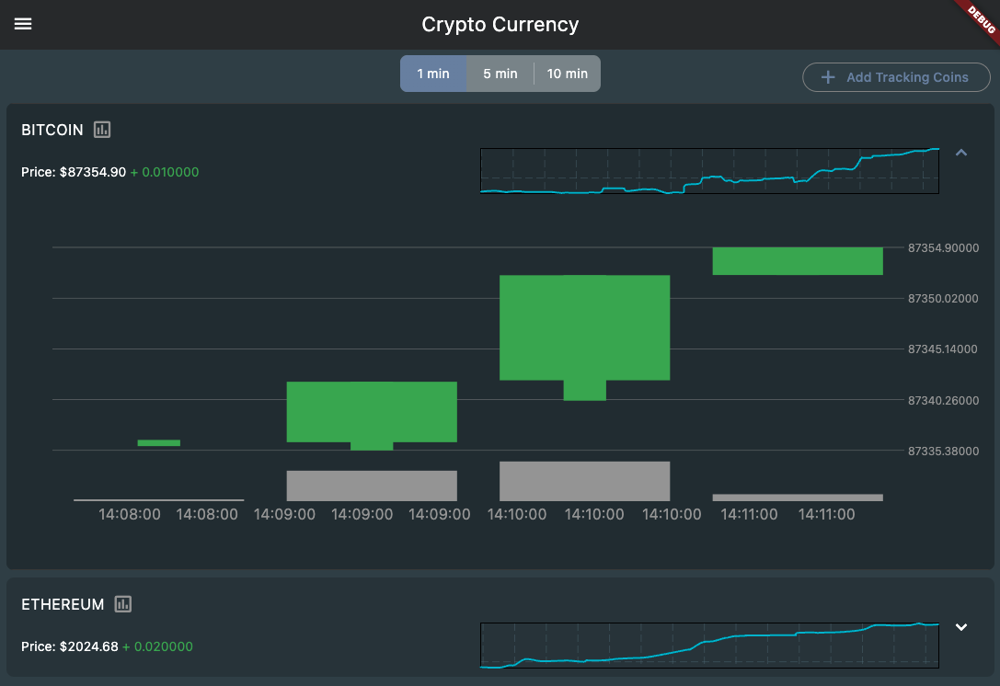

# Crypto Currency



A Flutter-based cryptocurrency trading and monitoring application that provides real-time price tracking, wallet management, and trading capabilities.

## Features

- Real-time cryptocurrency price monitoring
- Interactive price charts with FL Chart and Interactive Chart
- Wallet management system
- Trading functionality
- Local data persistence using Isar database
- Beautiful UI with Flex Color Scheme
- Loading animations with Lottie

## Tech Stack

- Flutter SDK (>=3.2.3)
- BLoC for state management
- Dio for HTTP requests
- WebSocket for real-time data
- Isar database for local storage
- FL Chart & Interactive Chart for data visualization

## Getting Started

### Prerequisites

- Flutter SDK (>=3.2.3)
- Dart SDK (>=3.2.3)

### Installation

1. Clone the repository
2. Install dependencies:
   ```bash
   flutter pub get
   ```
3. Run the build runner to generate necessary files:
   ```bash
   flutter pub run build_runner build
   ```
4. Run the application:
   ```bash
   flutter run
   ```

## Project Structure

- `lib/class/` - Data models and schemas
- `lib/cubit/` - BLoC state management
- `lib/http/` - API and network related code
- `lib/pages/` - Application screens
- `lib/utils/` - Utility functions and database management
- `lib/widgets/` - Reusable UI components

## Features in Detail

### Price Monitoring

- Real-time price updates
- Interactive price charts
- Historical data visualization

### Wallet Management

- Wallet creation and management
- Transaction history
- Balance tracking

### Settings

- Application preferences
- Theme customization
- Data management

## Dependencies

- `bloc: ^8.1.4` - State management
- `dio: ^5.7.0` - HTTP client
- `fl_chart: ^0.69.2` - Chart visualization
- `isar: 4.0.0-dev.14` - Local database
- `lottie: ^3.2.0` - Animation support
- `web_socket_channel: ^2.4.0` - WebSocket functionality

## License

This project includes a license page accessible within the application.
